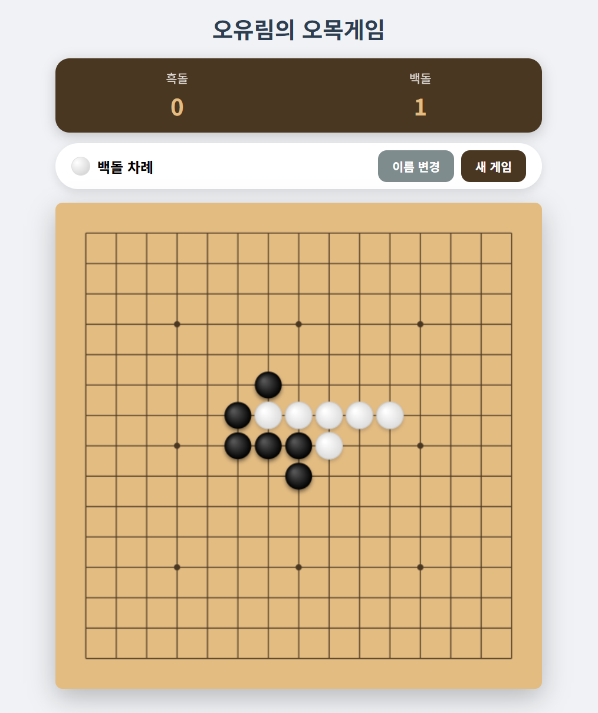

🎮 오유림의 오목게임 (Omok Game)

웹 브라우저에서 바로 즐길 수 있는 깔끔하고 직관적인 오목 게임입니다. 별도의 설치 없이 PC와 모바일 환경 어디서나 친구와 함께 대전할 수 있습니다.

🔗 접속 링크

지금 바로 아래 주소에서 게임을 플레이해보세요!  
https://omokgames.netlify.app/

📷 게임 화면

<!--
[이미지 넣는 방법]

같은 폴더에 이미지(예: https://www.google.com/search?q=screenshot.png)를 저장합니다.

아래 주소의 ( ) 괄호 안에 파일 이름을 넣으세요. 예:

깃허브 등에 올릴 경우 절대 경로를 사용하거나 파일을 함께 업로드하세요.

-->

✨ 주요 기능

싱글 파일 구현: HTML, CSS, JavaScript를 하나의 파일로 구성하여 가볍고 빠른 실행이 가능합니다.

반응형 디자인: 모바일 세로 모드에 최적화되어 있으며, 기기 크기에 맞춰 바둑판 크기가 자동으로 조절됩니다.

실시간 점수 시스템: 승리 시 점수가 누적되며, 필요에 따라 점수를 초기화할 수 있습니다.

플레이어 이름 설정: 기본값(흑돌/백돌) 외에 원하는 이름으로 자유롭게 변경하여 게임을 즐길 수 있습니다.

생동감 넘치는 효과:

사운드: Web Audio API를 활용한 돌 놓는 소리 및 승리 효과음 탑재.

애니메이션: 승리 시 화려한 종이가루(폭죽) 효과 제공.

모바일 최적화:

가로 모드 시 세로 모드 권장 안내창 표시.

핀치 줌(Pinch-to-zoom) 지원으로 정밀한 착수 가능.

🕹️ 게임 방법

이름 설정: 게임 시작 시 플레이어의 이름을 입력하거나 기본값으로 시작합니다.

착수: 바둑판의 교차점을 터치하거나 클릭하여 돌을 놓습니다. (흑돌 선공)

승리 조건: 가로, 세로, 대각선 방향 중 하나라도 돌 5개를 먼저 나열하면 승리합니다.

확대/축소: 모바일에서는 손가락으로 벌려 화면을 확대하여 더 정확하게 돌을 놓을 수 있습니다.

🛠️ 사용 기술

Language: HTML5, CSS3, JavaScript

API: Canvas API (바둑판 및 돌 렌더링), Web Audio API (사운드 효과)

Deployment: Netlify

📄 라이선스

이 프로젝트는 개인 학습 및 비상업적 용도로 자유롭게 사용 가능합니다.